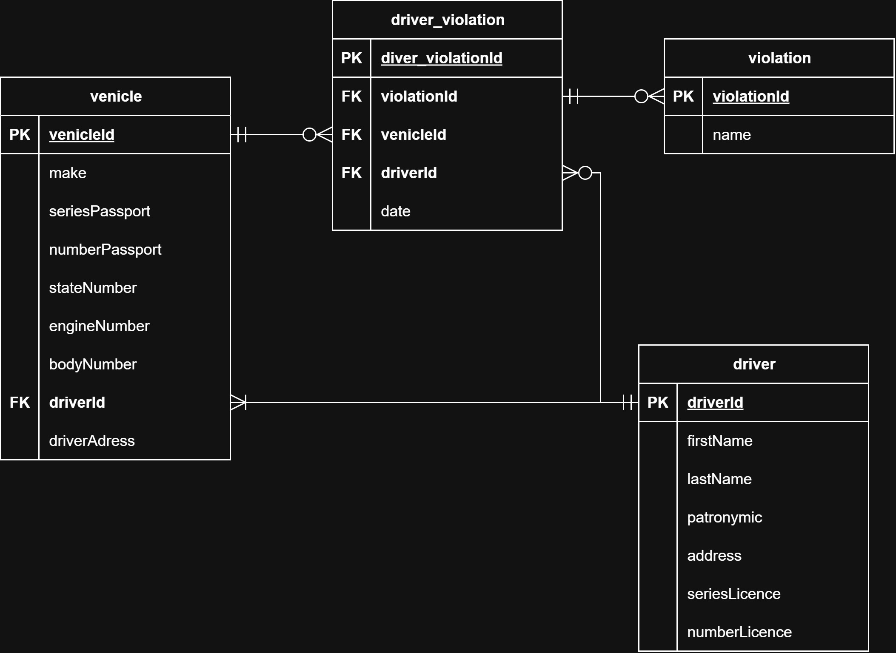

# Лабораторная работа 1

## ГАИ - Задание 19
Имеются автомобили (марка автомобиля, серия и номер технического паспорта, государственный номер, номер двигателя, номер кузова, владелец, адрес владельца), водители (фамилия, имя и отчество, адрес, серия и номер водительского удостоверения) и нарушения (название нарушения). Накапливается информация о нарушителях, являющихся водителями определенных автомобилей, совершивших определенное нарушение в определенную дату. 

**Выходные документы:**
- Выдать список автомобилей с указанием количества нарушений за определенный интервал дат, отсортированный по маркам и ФИО владельцев 
- Выдать список водителей, совершивших определенный вид нарушения на автомобилях определенной марки, отсортированный по ФИО водителей и номерам автомобилей.

**Er-диаграмма**


# Лабораторная работа 1

## Логическая модель
**Сущности:**
    - PK - первичный ключ
    - FK - внешний ключ
    
    *Автомобили (venicle):* 
        - автомобиль (venicleId, PK)
        - марка автомобиля (make)
        - серия технического паспорта (seriesPassport)
        - номер технического паспорта (numberPassport)
        - государственный номер (numberPassport)
        - номер двигателя (engineNumber)
        - номер кузова (bodyNumber)
        - водитель (driverId, FK к сущности "Водители")
        - адрес владельца (driverAdress)
        
    *Водители (driver):*
        - водитель (driverId, PK)
        - имя (firstName)
        - фамилия (lastName)
        - отчество (patronymic)
        - адрес (address)
        - серия водительского удостоверения (seriesLicence)
        - номер водительского удостоверения (numberLicence)
        
    *Нарушения водителя (driver_violation):*
        - нарушения водителя (driver_violationId, PK)
        - нарушение (violationId, FK к сущности "Нарушения")
        - автомобиль (venicleId, FK к сущности "Автомобили")
        - водитель (driverId, FK к сущности "Водители")
        - дата (date)
        
    *Нарушения (violation):* 
        - нарушение (violationId, PK)
        - название нарушения (name)

    *Взаимосвязи:*
        - "Водители" и "Автомобили": Связь один-ко-многим (один водитель может быть связан с несколькими автомобилями).
        - "Автомобили" и "Нарушения водителя": Связь ноль-ко-многим (один автомобиль может быть не связан или связан с несколькими нарушениями водителя).
        - "Водители" и "Нарушения водителя": Связь ноль-ко-многим (один водитель может быть не связан или связан с нарушениями водителя).
        - "Нарушения" и "Нарушения водителя": Связь ноль-ко-многим (один нарушение может быть не связан или связан с несколькими нарушениями водителя).

## Физическая модель
  - ```make::varchar```
  - ```seriesPassport::varchar```
  - ```numberPassport::varchar```
  - ```stateNumber::varchar```
  - ```engineNumber::varchar```
  - ```bodyNumber::varchar```
  - ```dreverId::integer primery key```
  - ```driverAdress::varchar```
  - ```firstName::text```
  - ```lastName::text```
  - ```patronymic::text```
  - ```address::text```
  - ```seriesLicence::varchar```
  - ```numberLicence::varchar```
  - ```venicleId::integer primery key```
  - ```violationId::integer primery key```
  - ```name::text```
    


    

